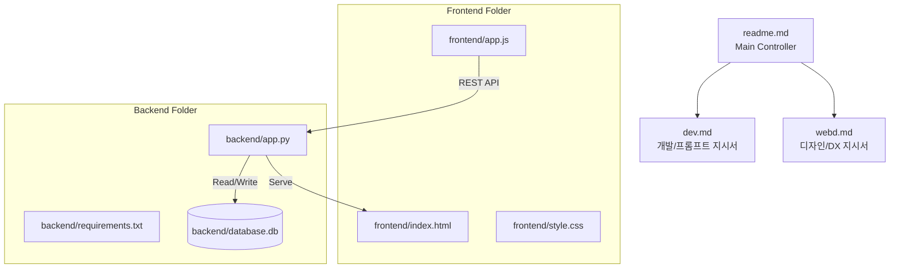

# 소규모 코드 리뷰 AI 에이전트 (MVP) - Main Controller

본 프로젝트는 GitHub Pull Request(PR)의 Diff를 자동으로 분석하여 버그를 사전에 탐지하고, 코드 품질 개선(성능, 리팩토링) 및 테스트 코드 자동 생성을 수행하는 AI 에이전트의 2단계 웹 버전(Python 백엔드 + SQLite)입니다.

---

## 📂 프로젝트 파일 구조 (Multi-File Structure)

2단계 아키텍처 개편에 따라 코드는 백엔드(Python/SQLite)와 프론트엔드(HTML/CSS/JS)로 분리되어 체계화되었습니다.



1. **[readme.md](file:///c:/Users/tomba/OneDrive/문서/GitHub/code-review-ai-agent/readme.md) (본 문서)**
   - 프로젝트 개요, 폴더 구조, 엔드투엔드 워크플로우 가이드를 다룹니다.
2. **[webd.md](file:///c:/Users/tomba/OneDrive/문서/GitHub/code-review-ai-agent/webd.md) (디자인 파트 지시서)**
   - UI/UX 및 DX(개발자 경험)의 관점에서 코드 변경점 하이라이트(라임색) 및 이모지 규칙 등의 포맷팅 규격을 다룹니다.
3. **[dev.md](file:///c:/Users/tomba/OneDrive/문서/GitHub/code-review-ai-agent/dev.md) (개발 파트 지시서)**
   - SQLite 데이터베이스 스키마 및 REST API 명세서, 프롬프트 템플릿 설계 등을 기술합니다.
4. **[manual.md](file:///c:/Users/tomba/OneDrive/문서/GitHub/code-review-ai-agent/manual.md) (사용자 매뉴얼)**
   - 가상환경 설정, 백엔드 기동 및 최종 연동 확인 방법을 안내합니다.

---

## 🔄 엔드투엔드 워크플로우 (End-to-End Workflow)

시스템은 아래 흐름으로 연동되며, SQLite DB를 통해 모든 설정과 기록이 영구적으로 보존됩니다.

```mermaid
sequenceDiagram
    autonumber
    actor Developer as 개발자 (웹 UI)
    participant FE as 프론트엔드 (app.js)
    participant BE as 백엔드 (app.py)
    database DB as SQLite (database.db)
    participant LLM as OpenAI API (GPT-4o)

    Developer->>FE: 코드 입력 / GitHub URL 로드
    FE->>BE: 분석 요청 (POST /api/review)
    BE->>DB: 저장된 OpenAI API Key & Model 정보 조회
    DB-->>BE: API Key 반환
    BE->>LLM: 프롬프트 전달 및 분석 요청 (GPT-4o)
    LLM-->>BE: 분석 완료 리포트 반환 (마크다운)
    BE-->>FE: 리뷰 텍스트 전송
    Note over FE: JsDiff 라이브러리를 사용해<br/>기존-개선 코드 간 라인 하이라이팅 적용 (lime)
    FE-->>Developer: 라이트 테마 기반의 리포트 화면 표출
    
    Developer->>FE: "DB에 저장" 클릭
    FE->>BE: 이력 저장 요청 (POST /api/history)
    BE->>DB: 리뷰 데이터 영구 기입
    DB-->>BE: 저장 성공
    BE-->>FE: 이력 갱신 데이터 반환
```
